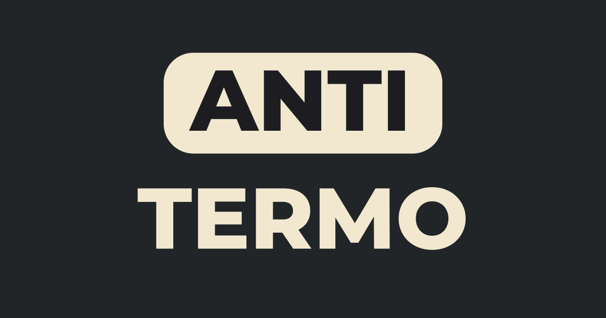

# AntiTermo

Em AntiTermo seu objetivo é errar a palavra do dia. Fácil, não é? Bom, nem tanto 😉

### AntiTermo é um jogo baseado em Termo, AntiWordle e Don't Wordle

---

## !technologies

- Next.js
- Typescript
- TailwindCSS
- Zustand
- Framer Motion
- E muita, mas muita lógica!

🐲 From [Henrique Gonçalves](https://github.com/hnqg) (or hnqg if you find better), you can find me at  
